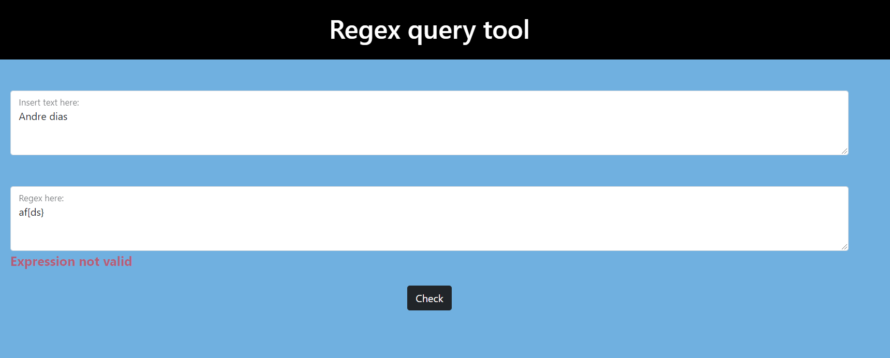

[python-download]: https://www.python.org/downloads/
[django-link]: https://www.djangoproject.com/


# Regex Query Tool

<p align="center">
    
</p>
A simple app where a user can query through a text using regular expressions.

### Built with


## :hammer: Getting started

### Pre requisites

- [Python][python-download] - 3.9 or up
- [Django][django-link] - 3.2.4


### Installation

#### Pipfile and Pipfile.Lock
 

1. Download Pipenv through the terminal window ***(make sure you have [Python][python-download] installed)***:

	```python
    pip install pipenv
    ```
    
2. After installing pipenv all you have to do is to download the files and in the terminal window, go to the folder with these files and run:

	```python
    pipenv install
    ```
    This will create a virtual environment with all the modules needed.

3. We must have this virtual environment to run our program, through the terminal window:

	```python
    pipenv shell # To run the virtual environment
    exit         # To close the virtual environment
    ```

If any doubts here's a link to some more explanations: [Pipenv](https://pipenv-fork.readthedocs.io/en/latest/basics.html)


## :mag_right: Use the query tool

On your terminal window, go to the folder with the Pip files and type: 

```python
pipenv shell
```


Then change to the folder with `manage.py` and type: 

```python
python manage.py runserver
```
Paste this link on your browser:
**http://127.0.0.1:8000/regex**
